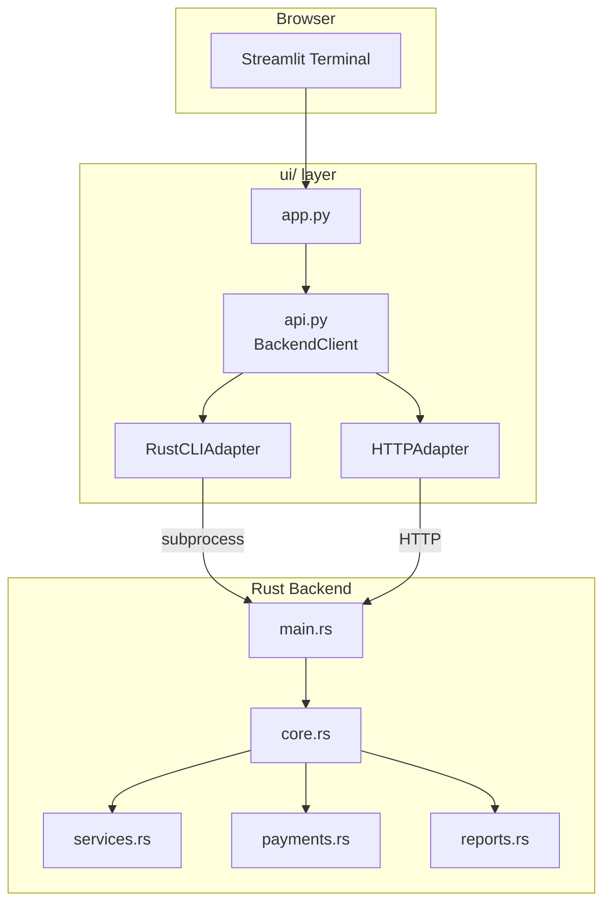
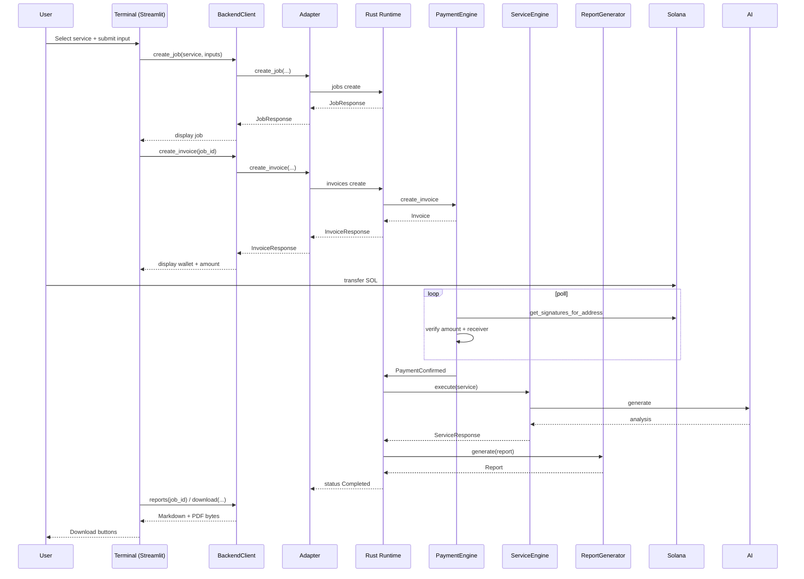
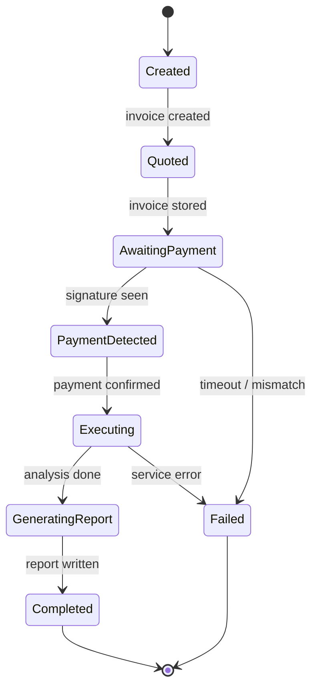
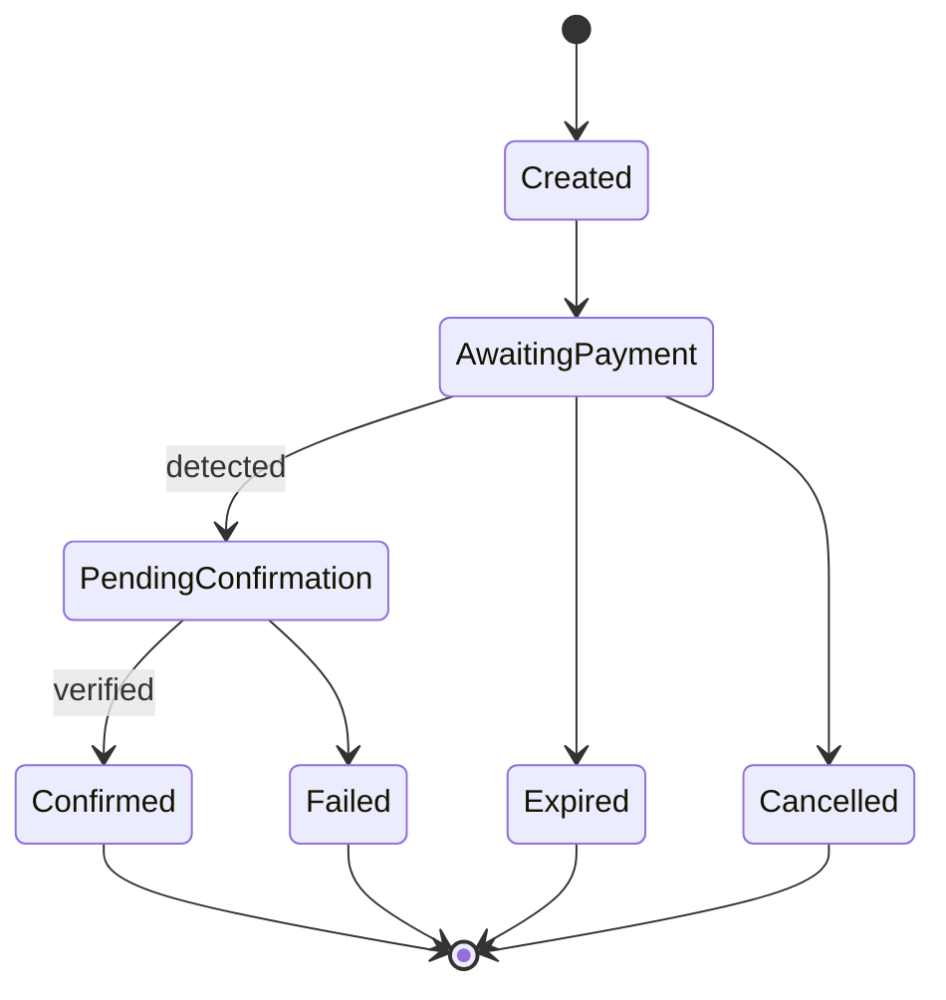

# ClawHire API Specification

**Version:** 1.0.0  
**Document Date:** 2026-07-25  
**Status:** Production  
**Authors:** ClawHire Architecture Team  

## Revision History

| Version | Date       | Author                     | Changes                          |
|---------|------------|----------------------------|----------------------------------|
| 1.0.0   | 2026-07-25 | ClawHire Architecture Team | Initial production API specification |

---

## 1. Overview

### Purpose

This document is the official API specification for ClawHire. It describes every public interface exposed by the system: the Python bridge layer (`ui/api.py`), the Rust CLI surface, the shared data models, request/response contracts, error semantics, and integration points between the Streamlit frontend and the Rust backend.

### Architecture

ClawHire is a self-hosted AI blockchain freelancer. The backend is implemented entirely in Rust. The frontend is implemented in Streamlit. Communication between the two layers is mediated exclusively by the Python module `ui/api.py`.

### Design Principles

- **Single bridge** – All frontend-to-backend traffic flows through `BackendClient`.
- **Typed contracts** – Every payload is represented by a Pydantic model on the Python side and a corresponding Rust struct.
- **Mode-agnostic** – The same client API works against either a local CLI binary or a future HTTP server.
- **Fail-closed** – Invalid inputs, missing configuration, and verification failures produce explicit errors; silent success is never assumed.
- **No private keys** – The system never holds or transmits signing material.
- **Configuration externalised** – Prices, service flags, and RPC endpoints live outside the binary.

### Backend

Rust binary (`clawhire`) providing CLI subcommands and (future) HTTP endpoints. Core modules: `core`, `services`, `payments`, `reports`.

### Frontend

Streamlit application (`ui/app.py`) that presents a terminal-style user experience and drives the job lifecycle through the API layer.

### Bridge Layer

`ui/api.py` – Contains `BackendClient`, adapters (`RustCLIAdapter`, `HTTPAdapter`), managers (`WalletManager`, `DownloadManager`, `HealthMonitor`, `CacheManager`), and the configuration loader.

---

## 2. API Architecture



Traffic always originates from the Streamlit process, crosses the Python bridge, and is executed either as a CLI invocation of the Rust binary or (when an HTTP server is present) as REST calls. The Rust runtime owns job state, payment monitoring, service execution, and report generation.

---

## 3. Backend Modes

| Mode   | Description                                                                 | When Selected                                      |
|--------|-----------------------------------------------------------------------------|----------------------------------------------------|
| `AUTO` | Prefer local binary if present; otherwise fall back to HTTP                 | Default (`BACKEND_MODE` unset or `AUTO`)           |
| `CLI`  | Always invoke the Rust binary via subprocess                                | `BACKEND_MODE=CLI`                                 |
| `HTTP` | Always talk to a remote or local HTTP endpoint                              | `BACKEND_MODE=HTTP`                                |

### Auto-Detection Logic

```python
if mode == BackendMode.AUTO:
    if executable_path.exists():
        return RustCLIAdapter(...)
    return HTTPAdapter(...)
```

### Adapter Architecture

Both adapters implement the abstract `BackendAdapter` interface. The client never branches on mode after construction; every public method is mode-agnostic.

### Future HTTP Compatibility

The `HTTPAdapter` already defines the expected REST surface (`/health`, `/version`, `/services`, `/jobs`, `/invoices`, `/reports`, `/wallet`, `/status`, `/configuration`). When the Rust binary gains an HTTP server, no Python changes are required beyond setting `BACKEND_MODE=HTTP` and `BACKEND_HTTP_URL`.

---

## 4. Authentication

### Current Implementation

No authentication is required. The system is designed for single-operator self-hosted deployment. All endpoints are reachable by any process that can execute the binary or reach the HTTP port.

### Future Support

| Mechanism     | Intended Use Case                          |
|---------------|--------------------------------------------|
| API Keys      | Machine-to-machine automation              |
| JWT           | Multi-user deployments                     |
| OAuth         | External identity providers                |
| Session Tokens| Browser-based authenticated sessions       |

When authentication is introduced it will be enforced at the adapter boundary and will not alter the existing data models.

---

## 5. Data Models

All models are defined in `ui/api.py` with Pydantic and mirror the Rust structs in `core.rs`, `payments.rs`, and `reports.rs`.

### HealthResponse

| Field       | Type       | Description                          | Example                  |
|-------------|------------|--------------------------------------|--------------------------|
| `status`    | `str`      | Overall health status                | `"ok"`                   |
| `uptime`    | `int`      | Seconds since process start          | `3600`                   |
| `timestamp` | `datetime` | UTC time of the health check         | `2026-07-25T10:00:00Z`   |

### VersionResponse

| Field         | Type   | Description                     | Example                |
|---------------|--------|---------------------------------|------------------------|
| `version`     | `str`  | Semantic version                | `"1.0.0"`              |
| `build_hash`  | `str`  | Git commit or build identifier  | `"a1b2c3d"`            |
| `environment` | `str`  | Runtime environment             | `"development"`        |

### ServiceResponse

| Field              | Type          | Description                              | Example                          |
|--------------------|---------------|------------------------------------------|----------------------------------|
| `name`             | `str`         | Human-readable service name              | `"Smart Contract Security Review"` |
| `service_type`     | `ServiceType` | Enum value                               | `"SmartContractReview"`          |
| `description`      | `str`         | Short description                        | `"AI-powered security audit..."` |
| `base_price`       | `float`       | Price in SOL                             | `0.20`                           |
| `currency`         | `str`         | Always `"SOL"` in current release        | `"SOL"`                          |

### JobResponse

| Field          | Type          | Description                          | Example                          |
|----------------|---------------|--------------------------------------|----------------------------------|
| `job_id`       | `UUID`        | Unique job identifier                | `"550e8400-e29b-41d4-a716-446655440000"` |
| `service_type` | `ServiceType` | Requested service                    | `"OnChainIntelligence"`          |
| `status`       | `JobStatus`   | Current lifecycle status             | `"AwaitingPayment"`              |
| `created_at`   | `datetime`    | Creation timestamp (UTC)             | `2026-07-25T10:00:00Z`           |
| `updated_at`   | `datetime`    | Last status change (UTC)             | `2026-07-25T10:01:00Z`           |

### JobStatus Enum

```
Created | Quoted | AwaitingPayment | PaymentDetected | Executing
GeneratingReport | Completed | Failed | Cancelled
```

### InvoiceResponse

| Field            | Type            | Description                          | Example                          |
|------------------|-----------------|--------------------------------------|----------------------------------|
| `invoice_id`     | `UUID`          | Unique invoice identifier            | `"7c9e6679-7425-40de-944b-e07fc1f90ae7"` |
| `job_id`         | `UUID`          | Associated job                       | (same format)                    |
| `amount`         | `float`         | Exact amount due in SOL              | `0.20`                           |
| `currency`       | `str`           | `"SOL"`                              | `"SOL"`                          |
| `wallet_address` | `str`           | Merchant receive address             | `"So111..."`                     |
| `status`         | `InvoiceStatus` | Current invoice status               | `"AwaitingPayment"`              |
| `expires_at`     | `datetime`      | Absolute expiry (UTC)                | `2026-07-25T10:15:00Z`           |

### InvoiceStatus Enum

```
Created | AwaitingPayment | PendingConfirmation | Confirmed
Expired | Failed | Cancelled
```

### ReportResponse

| Field           | Type       | Description                          | Example                          |
|-----------------|------------|--------------------------------------|----------------------------------|
| `report_id`     | `UUID`     | Unique report identifier             | (UUID)                           |
| `job_id`        | `UUID`     | Source job                           | (UUID)                           |
| `title`         | `str`      | Report title                         | `"Smart Contract Security Audit Report"` |
| `summary`       | `str`      | Short executive summary              | `"Audit completed with risk level Medium."` |
| `created_at`    | `datetime` | Generation timestamp                 | (ISO-8601)                       |
| `markdown_path` | `str`      | Filesystem path to Markdown          | `"storage/reports/CHR-REPORT-....md"` |
| `pdf_path`      | `str`      | Filesystem path to PDF               | `"storage/reports/CHR-REPORT-....pdf"` |

### WalletResponse

| Field     | Type    | Description                          | Example                          |
|-----------|---------|--------------------------------------|----------------------------------|
| `address` | `str`   | Merchant Solana address              | `"So11111111111111111111111111111111111111112"` |
| `network` | `str`   | Cluster name                         | `"devnet"`                       |
| `balance` | `float` | Optional SOL balance (if queried)    | `1.25`                           |

### ConfigurationResponse

| Field          | Type            | Description                          | Example                          |
|----------------|-----------------|--------------------------------------|----------------------------------|
| `environment`  | `str`           | Runtime environment                  | `"development"`                  |
| `rpc_endpoint` | `str`           | Solana RPC URL                       | `"https://api.devnet.solana.com"`|
| `features`     | `Dict[str,bool]`| Feature-flag map                     | `{"smart_contract_review": true}`|

### PaymentResponse

| Field                   | Type       | Description                          | Example                          |
|-------------------------|------------|--------------------------------------|----------------------------------|
| `transaction_signature` | `str`      | Solana transaction signature         | `"5VERv8..."`                    |
| `status`                | `str`      | `"confirmed"` / `"detected"` / etc.  | `"confirmed"`                    |
| `amount`                | `float`    | Amount received                      | `0.20`                           |
| `timestamp`             | `datetime` | Confirmation time (UTC)              | (ISO-8601)                       |

### SystemStatus

| Field           | Type               | Description                          | Example                          |
|-----------------|--------------------|--------------------------------------|----------------------------------|
| `connection`    | `ConnectionStatus` | `CONNECTED` / `DISCONNECTED` / …     | `"CONNECTED"`                    |
| `backend_mode`  | `BackendMode`      | Active adapter                       | `"CLI"`                          |
| `active_jobs`   | `int`              | Number of non-terminal jobs          | `2`                              |

### ServiceType Enum

```
SmartContractReview | OnChainIntelligence
```

---

## 6. Service APIs

### `services()`

Returns the list of available AI blockchain services and their pricing metadata.

**Signature (Python)**

```python
async def services(self) -> List[ServiceResponse]
```

**CLI Equivalent**

```bash
clawhire --format json services list
```

**Response Example**

```json
[
  {
    "name": "Smart Contract Security Review",
    "service_type": "SmartContractReview",
    "description": "Professional AI-powered security audit for Solana smart contracts.",
    "base_price": 0.20,
    "currency": "SOL"
  },
  {
    "name": "On-chain Intelligence Report",
    "service_type": "OnChainIntelligence",
    "description": "Professional AI-powered wallet and transaction intelligence report.",
    "base_price": 0.10,
    "currency": "SOL"
  }
]
```

**Errors**

| Condition                    | Error                        |
|------------------------------|------------------------------|
| Backend unreachable          | `BackendUnavailable`         |
| Invalid JSON from CLI        | `ValueError`                 |

---

## 7. Job APIs

### `create_job(service_type, inputs)`

Creates a new job in status `Created`.

**Signature**

```python
async def create_job(
    self,
    service_type: ServiceType,
    inputs: Dict[str, Any]
) -> JobResponse
```

**Parameters**

| Name           | Type          | Required | Description                                      |
|----------------|---------------|----------|--------------------------------------------------|
| `service_type` | `ServiceType` | Yes      | Target service                                   |
| `inputs`       | `dict`        | Yes      | Service-specific payload (`target`, `url`, …)    |

**Example Call**

```python
job = await client.create_job(
    ServiceType.SmartContractReview,
    {"target": "https://github.com/example/solana-program"}
)
```

**Response Example**

```json
{
  "job_id": "550e8400-e29b-41d4-a716-446655440000",
  "service_type": "SmartContractReview",
  "status": "Created",
  "created_at": "2026-07-25T10:00:00Z",
  "updated_at": "2026-07-25T10:00:00Z"
}
```

### `job(job_id)`

Retrieves a single job by ID.

```python
async def job(self, job_id: uuid.UUID) -> JobResponse
```

### `jobs()`

Returns all known jobs (active + completed in the current process).

```python
async def jobs(self) -> List[JobResponse]
```

### Status Transitions

```
Created → Quoted → AwaitingPayment → PaymentDetected
→ Executing → GeneratingReport → Completed
                                    ↘ Failed
                                    ↘ Cancelled
```

---

## 8. Invoice APIs

### `create_invoice(job_id)`

Generates a payment invoice for an existing job and advances the job to `Quoted` / `AwaitingPayment`.

```python
async def create_invoice(self, job_id: uuid.UUID) -> InvoiceResponse
```

**Response Example**

```json
{
  "invoice_id": "7c9e6679-7425-40de-944b-e07fc1f90ae7",
  "job_id": "550e8400-e29b-41d4-a716-446655440000",
  "amount": 0.20,
  "currency": "SOL",
  "wallet_address": "So11111111111111111111111111111111111111112",
  "status": "Created",
  "expires_at": "2026-07-25T10:15:00Z"
}
```

### `invoice(invoice_id)`

Fetches current invoice state.

```python
async def invoice(self, invoice_id: uuid.UUID) -> InvoiceResponse
```

### `wait_payment(invoice_id)`

Blocks (or long-polls) until payment is detected/confirmed or the invoice expires.

```python
async def wait_payment(self, invoice_id: uuid.UUID) -> PaymentResponse
```

**Timeout** – Controlled by `payment_timeout_seconds` / `invoice_expiry_minutes` (default 15 minutes).

**Invoice Lifecycle**

```
Created → AwaitingPayment → PendingConfirmation → Confirmed
                         ↘ Expired
                         ↘ Failed
                         ↘ Cancelled
```

---

## 9. Wallet APIs

### `wallet()`

Returns the configured merchant wallet.

```python
async def wallet(self) -> WalletResponse
```

**Address Format** – Base58-encoded Solana public key (32–44 characters). Validated with `solana_sdk::pubkey::Pubkey::from_str`.

**Example**

```json
{
  "address": "So11111111111111111111111111111111111111112",
  "network": "devnet",
  "balance": 1.25
}
```

**Validation Helper**

```python
def validate(self, address: str) -> bool:
    return 32 <= len(address) <= 44
```

---

## 10. Payment APIs

Payment operations are performed by the Rust `PaymentEngine` and surface through the models above.

| Operation              | Description                                                                 |
|------------------------|-----------------------------------------------------------------------------|
| Detection              | Background monitor polls `get_signatures_for_address` every 5 s             |
| Verification           | Full transaction fetched; amount and receiver validated                     |
| Confirmation           | Invoice status → `Confirmed`; job status → `PaymentConfirmed`               |
| Timeout                | After `invoice_expiry_minutes` the invoice is marked `Expired`              |
| Failure                | Amount/receiver mismatch or on-chain error → `Failed`                       |

**RPC Polling Interval** – Configurable via `payments.poll_interval_seconds` (default 5).

**Confirmation Requirement** – `confirmation_count = 1` (confirmed commitment).

---

## 11. Report APIs

### `reports(job_id)`

Lists all reports generated for a job.

```python
async def reports(self, job_id: uuid.UUID) -> List[ReportResponse]
```

### `download(report_id, format_type)`

Retrieves the raw bytes of a report.

```python
async def download(
    self,
    report_id: uuid.UUID,
    format_type: str   # "markdown" | "pdf"
) -> bytes
```

**Supported Formats**

| Format     | MIME Type          | Extension |
|------------|--------------------|-----------|
| `markdown` | `text/markdown`    | `.md`     |
| `pdf`      | `application/pdf`  | `.pdf`    |

**Example Usage (Python)**

```python
md_bytes = await client.download(report_id, "markdown")
pdf_bytes = await client.download(report_id, "pdf")
```

---

## 12. Health APIs

### `health()`

```python
async def health(self) -> HealthResponse
```

### `status()`

```python
async def status(self) -> SystemStatus
```

### `configuration()`

```python
async def configuration(self) -> ConfigurationResponse
```

### `version()`

```python
async def version(self) -> VersionResponse
```

**CLI Equivalents**

```bash
clawhire health
clawhire version
clawhire --format json status
clawhire --format json config get
```

---

## 13. CLI Interface

All CLI commands support an optional `--format json` flag for machine-readable output.

### `clawhire start`

**Purpose** – Launch background daemon and payment monitor.  
**Syntax** – `clawhire start`  
**Example** – `clawhire start`  
**Output** – Continuous logging until SIGINT/SIGTERM.

### `clawhire run`

**Purpose** – Single-pass synchronous worker execution.  
**Syntax** – `clawhire run`  
**Example** – `clawhire run`  
**Output** – Execution log then exit.

### `clawhire services`

**Purpose** – List registered services and pricing.  
**Syntax** – `clawhire services` / `clawhire --format json services list`  
**Example Output**

```
Service ID:          SmartContractReview
Name:                Smart Contract Security Review
Price:               0.20 SOL
...
```

### `clawhire invoices`

**Purpose** – List all tracked invoices.  
**Syntax** – `clawhire invoices`  
**Example** – `clawhire invoices`

### `clawhire reports`

**Purpose** – List generated reports.  
**Syntax** – `clawhire reports`  
**Example** – `clawhire reports`

### `clawhire version`

**Purpose** – Print version and build information.  
**Syntax** – `clawhire version`  
**Output** – `ClawHire Version 1.0.0 (ZeroClaw Edition 2024)`

### `clawhire health`

**Purpose** – System health check.  
**Syntax** – `clawhire health`  
**Output** – Configuration status, RPC URL, merchant wallet, AI provider, storage status.

---

## 14. Python API

### BackendClient

Primary entry point used by the Streamlit application.

```python
class BackendClient:
    def __init__(self) -> None
    async def connect(self) -> None
    async def disconnect(self) -> None
    async def health(self) -> HealthResponse
    async def status(self) -> SystemStatus
    async def version(self) -> VersionResponse
    async def configuration(self) -> ConfigurationResponse
    async def services(self) -> List[ServiceResponse]
    async def create_job(self, service_type: ServiceType, inputs: Dict[str, Any]) -> JobResponse
    async def job(self, job_id: uuid.UUID) -> JobResponse
    async def jobs(self) -> List[JobResponse]
    async def create_invoice(self, job_id: uuid.UUID) -> InvoiceResponse
    async def invoice(self, invoice_id: uuid.UUID) -> InvoiceResponse
    async def wait_payment(self, invoice_id: uuid.UUID) -> PaymentResponse
    async def reports(self, job_id: uuid.UUID) -> List[ReportResponse]
    async def download(self, report_id: uuid.UUID, format_type: str) -> bytes
    async def wallet(self) -> WalletResponse
```

### RustCLIAdapter

```python
class RustCLIAdapter(BackendAdapter):
    def __init__(self, executable_path: Path, timeout: int)
    async def execute(self, args: List[str]) -> str
    async def execute_json(self, args: List[str]) -> Any
    # implements every BackendAdapter method
```

### HTTPAdapter

```python
class HTTPAdapter(BackendAdapter):
    def __init__(self, base_url: str, timeout: int)
    async def _request(self, method: str, endpoint: str, **kwargs) -> Any
    # implements every BackendAdapter method
```

### WalletManager

```python
class WalletManager:
    def __init__(self, adapter: BackendAdapter)
    async def wallet(self) -> WalletResponse
    def validate(self, address: str) -> bool
```

### DownloadManager

```python
class DownloadManager:
    def __init__(self, download_dir: Path)
    def verify(self, file_path: Path) -> bool
    async def download_markdown(self, adapter: BackendAdapter, report_id: uuid.UUID) -> Path
    async def download_pdf(self, adapter: BackendAdapter, report_id: uuid.UUID) -> Path
```

### HealthMonitor

```python
class HealthMonitor:
    def __init__(self, adapter: BackendAdapter, interval: int = 30)
    async def check(self) -> None
    def start(self) -> None
    def stop(self) -> None
```

### CacheManager

```python
class CacheManager:
    # TTLCache instances for services, wallet, version, config, health
```

### ConfigurationLoader

```python
class ConfigurationLoader:
    def __init__(self)
    def load(self) -> None
    @property
    def backend_mode(self) -> BackendMode
    @property
    def executable_path(self) -> Path
    @property
    def http_url(self) -> str
    @property
    def timeout(self) -> int
    @property
    def retry_count(self) -> int
    @property
    def download_directory(self) -> Path
```

---

## 15. Request Flow



---

## 16. Error Handling

| Error Class                  | Origin              | Typical Cause                              | Retryable |
|------------------------------|---------------------|--------------------------------------------|-----------|
| `ConfigurationError`         | Config loader       | Missing TOML key, invalid wallet           | No        |
| `RPCError`                   | Payment / Service   | Solana RPC unreachable or rate-limited     | Yes       |
| `InvoiceError`               | PaymentEngine       | Job not found, invoice store failure       | No        |
| `TimeoutError`               | wait_payment / CLI  | Invoice expired or subprocess timeout      | No        |
| `PaymentVerificationError`   | SolanaPaymentProvider | Amount/receiver mismatch, bad signature  | No        |
| `DownloadError` / `IOError`  | DownloadManager     | Empty file, path traversal attempt         | No        |
| `BackendUnavailable`         | Adapter             | Binary missing, HTTP 5xx, connection refused | Yes     |
| `ValidationError`            | Service / API       | Invalid address, empty input, bad UUID     | No        |
| `ValueError`                 | execute_json        | Non-JSON output from CLI                   | No        |

### Retry Strategy

- Python adapters use `tenacity` with exponential backoff (3 attempts, 2–10 s).
- Rust payment engine retries RPC calls up to `max_retries` (default 5) with `retry_delay_seconds` (default 2).
- Non-retryable errors are propagated immediately to the UI.

---

## 17. Configuration

### Precedence (highest to lowest)

1. Process environment variables (`APP_*` on Rust side, direct env on Python side)
2. `.env` file (loaded by both layers)
3. `configs/app.toml`
4. `configs/services.toml`
5. `configs/pricing.toml`
6. Hard-coded defaults inside deserializers

### Relevant Variables

| Variable                 | Layer   | Purpose                              |
|--------------------------|---------|--------------------------------------|
| `BACKEND_MODE`           | Python  | `AUTO` / `CLI` / `HTTP`              |
| `RUST_EXECUTABLE_PATH`   | Python  | Path to `clawhire` binary            |
| `BACKEND_HTTP_URL`       | Python  | Base URL for HTTP adapter            |
| `API_TIMEOUT`            | Python  | Request timeout (seconds)            |
| `API_RETRY_COUNT`        | Python  | Adapter retry count                  |
| `DOWNLOAD_DIR`           | Python  | Local download cache                 |
| `MERCHANT_WALLET`        | Rust    | Receive-only Solana address          |
| `SOLANA_RPC_URL`         | Rust    | RPC endpoint                         |
| AI provider keys         | Rust    | OpenAI / Anthropic / OpenRouter      |

---

## 18. Security

| Concern                    | Mitigation                                                                 |
|----------------------------|----------------------------------------------------------------------------|
| Input validation           | UUID parsing, Solana address/signature validation, size limits             |
| Command execution safety   | Argument vectors only; never `shell=True`                                  |
| Shell safety               | `shlex.join` used only for logging                                         |
| RPC validation             | Amount tolerance 1e-7 SOL; exact receiver match                            |
| Secrets management         | Keys live in `.env` / environment; never committed                         |
| Path traversal             | Filename sanitisation rejects `..`, `/`, `\`                               |
| File validation            | Extension allow-list, max size 100 MB                                      |
| Markdown sanitisation      | Reports are generated from structured data; user content is never re-rendered as HTML without escaping in the terminal layer |

---

## 19. Performance

| Technique              | Implementation                                                                 |
|------------------------|--------------------------------------------------------------------------------|
| Caching                | `TTLCache` for services (1 h), wallet (5 min), version (24 h), health (10 s)   |
| Retry policy           | Exponential backoff via tenacity (Python) and configured retries (Rust)        |
| Connection pooling     | `httpx.AsyncClient` re-used for the lifetime of an HTTP adapter                |
| CLI execution          | Subprocess run in thread-pool executor to avoid blocking the event loop        |
| Lazy initialization    | Adapters and monitors created only when `BackendClient` is instantiated        |
| Concurrent jobs        | Hard limit `max_concurrent_jobs = 5`                                           |

---

## 20. Future API Roadmap

| Feature                  | Description                                              | Priority |
|--------------------------|----------------------------------------------------------|----------|
| HTTP REST API            | Full Axum/Actix server inside the Rust binary            | High     |
| WebSocket streaming      | Live job progress and payment detection events           | Medium   |
| Server-Sent Events       | Lightweight progress feed for the terminal UI            | Medium   |
| Authentication           | API keys + JWT                                           | High     |
| Mainnet profile          | First-class mainnet configuration                        | High     |
| Plugin SDK               | ZeroClaw plugin interface for additional services        | Medium   |
| Multi-tenant isolation   | Per-user job and invoice namespaces                      | Low      |

---

## 21. Appendix

### Glossary

| Term                 | Definition                                                                 |
|----------------------|----------------------------------------------------------------------------|
| Job                  | A single unit of work requested by a user                                  |
| Invoice              | A payment request tied to a job; contains amount, wallet, and expiry       |
| ServiceType          | One of the two supported AI analysis services                              |
| Adapter              | Concrete implementation of `BackendAdapter` (CLI or HTTP)                  |
| Merchant Wallet      | Receive-only Solana address that accepts service payments                  |
| ZeroClaw             | Underlying AI agent runtime used for long-running analysis                 |

### Status Codes (Future HTTP)

| Code | Meaning                          |
|------|----------------------------------|
| 200  | Success                          |
| 201  | Resource created                 |
| 400  | Validation error                 |
| 404  | Job / invoice / report not found |
| 408  | Payment or request timeout       |
| 500  | Internal server error            |
| 503  | Backend unavailable              |

### Job State Diagram



### Invoice State Diagram



### Reference Tables

**Service Prices (from `pricing.toml`)**

| Service ID | Display Name                      | Price (SOL) |
|------------|-----------------------------------|-------------|
| SCR-001    | Smart Contract Security Review    | 0.20        |
| OCI-001    | On-chain Intelligence Report      | 0.10        |

**Default Timeouts**

| Setting                      | Value   |
|------------------------------|---------|
| Invoice expiry               | 15 min  |
| Payment poll interval        | 5 s     |
| Job timeout                  | 30 min  |
| CLI / HTTP request timeout   | 30 s    |
| AI request timeout           | 300 s   |

---

*End of API Specification*  
*ClawHire v1.0.0 – 2026-07-25*
