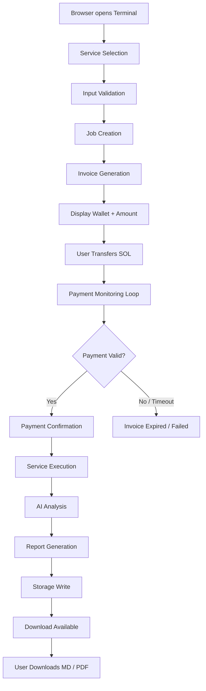
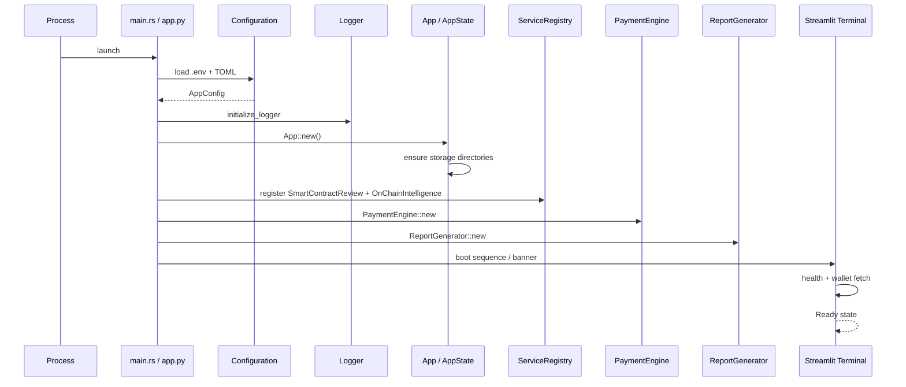
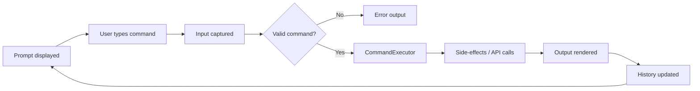
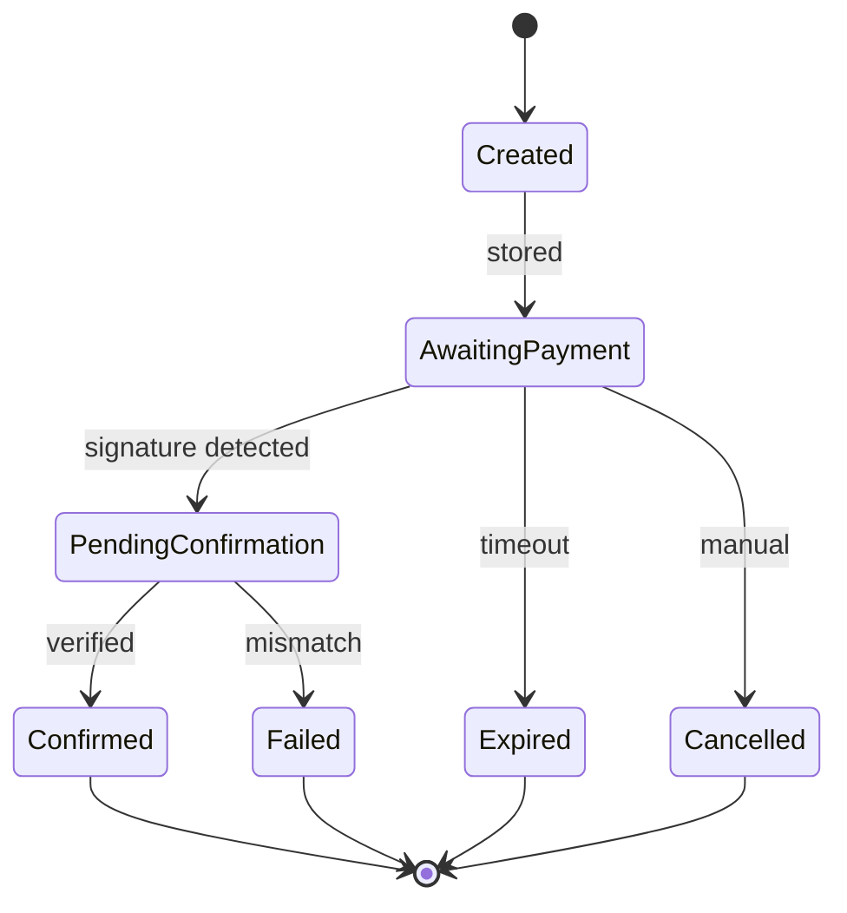
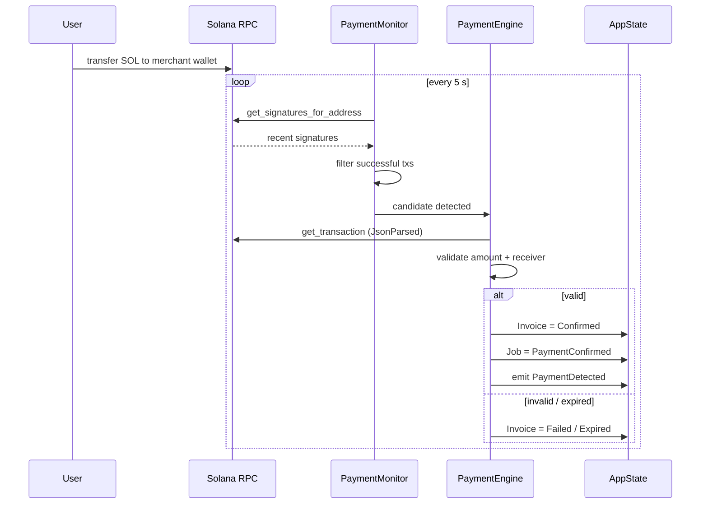
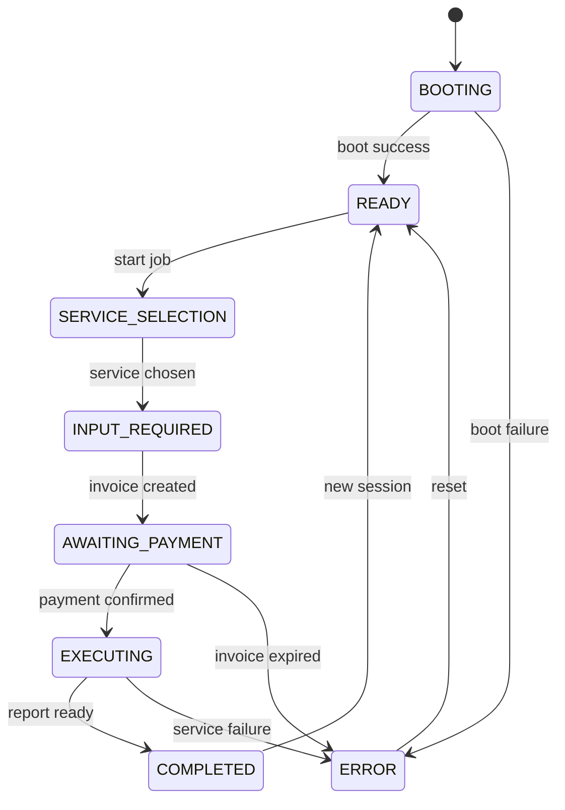
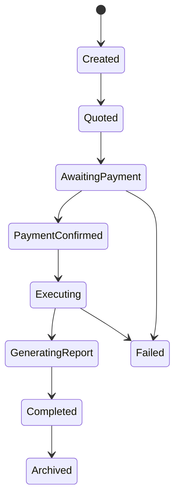
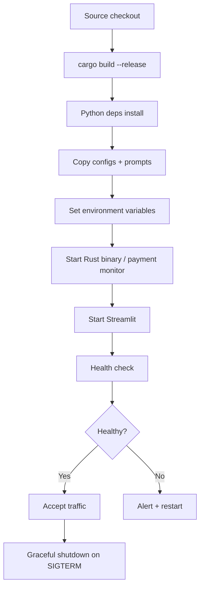

# ClawHire Workflow Documentation

**Version:** 1.0.0  
**Document Date:** 2026-07-25  
**Status:** Production  
**Authors:** ClawHire Architecture Team  

## Revision History

| Version | Date       | Author                     | Changes                                |
|---------|------------|----------------------------|----------------------------------------|
| 1.0.0   | 2026-07-25 | ClawHire Architecture Team | Initial production workflow specification |

---

## 1. Workflow Overview

### Purpose

This document is the official operational workflow specification for ClawHire. It describes every end-to-end process that occurs from application startup through service selection, payment, AI execution, report generation, and download. The specification is intended for maintainers, contributors, DevOps engineers, security reviewers, and Superteam bounty judges.

### Objectives

- Provide a single source of truth for all runtime workflows.
- Make state transitions explicit and auditable.
- Enable reproducible debugging and operational runbooks.
- Align frontend, Python bridge, and Rust backend behaviour.
- Support future extension without ambiguity about existing flows.

### System Actors

The system is composed of distinct actors that exchange typed messages and never share mutable state outside well-defined boundaries.

### Workflow Philosophy

ClawHire is a **state-driven machine-commerce system**. Every user request advances through a finite set of states. Side-effects (payment monitoring, AI calls, report writes) are triggered only by explicit state transitions. No background work is performed until payment is confirmed.

### State-Driven Architecture

Jobs, invoices, payments, reports, and the terminal session itself are modelled as independent state machines. The application runtime coordinates transitions and emits events for observability. This design guarantees that a failed payment cannot trigger service execution and that a completed report is always retrievable.

---

## 2. System Actors

| Actor                  | Language / Component          | Primary Responsibilities |
|------------------------|-------------------------------|--------------------------|
| End User               | Human                         | Selects service, supplies input, pays SOL, downloads reports |
| Streamlit Terminal     | `ui/app.py`, `ui/terminal.py`, `ui/components.py` | Renders terminal UI, captures commands, manages session state, displays progress |
| Python API Layer       | `ui/api.py`                   | Translates UI actions into backend calls; adapters, retries, caching, downloads |
| Rust Runtime           | `src/core.rs`, `src/main.rs`  | Owns global state, job lifecycle, event bus, configuration |
| Service Engine         | `src/services.rs`             | Validates input, loads prompts, invokes AI, normalises findings |
| Payment Engine         | `src/payments.rs`             | Creates invoices, polls Solana RPC, verifies amount/receiver, confirms payment |
| Report Engine          | `src/reports.rs`              | Builds Markdown + PDF, writes files, indexes metadata |
| Storage                | Filesystem (`storage/`)       | Persists reports, invoices, uploads, history |
| Configuration          | `configs/*.toml`, `.env`      | Supplies prices, RPC endpoints, feature flags, limits |
| Solana RPC             | External                      | Provides signatures, balances, transaction details |
| AI Runtime             | OpenAI / Anthropic / OpenRouter | Generates security or intelligence analysis from prompts + context |

---

## 3. Complete System Workflow



**Numbered End-to-End Steps**

1. User opens the Streamlit terminal in a browser.
2. User selects one of the two services.
3. User supplies input (GitHub URL, ZIP, Rust source, wallet address, or signature).
4. System validates input and creates a Job in status `Created`.
5. System generates an Invoice, advances Job to `AwaitingPayment`, and displays merchant wallet + amount.
6. User transfers the exact SOL amount to the merchant wallet.
7. Payment monitor polls Solana RPC, detects the signature, verifies amount and receiver.
8. On success the Job moves to `PaymentConfirmed` → `Executing`.
9. Service Engine loads the appropriate prompt, gathers context, calls the AI provider.
10. Findings / intelligence are normalised into a `ServiceResponse`.
11. Report Engine produces Markdown and PDF artefacts.
12. Files are written under `storage/reports/`; metadata is indexed.
13. Frontend surfaces download buttons; user retrieves the reports.

---

## 4. Application Startup Workflow



**Steps**

1. Process starts (`clawhire start` or `streamlit run ui/app.py`).
2. Environment variables and TOML files are loaded; missing required keys abort startup.
3. Logger is configured (console + rotating files).
4. `App` is constructed; storage directories are created if absent.
5. AI provider is selected from configuration.
6. Both services are registered in the `ServiceRegistry`.
7. Payment engine and report generator are instantiated.
8. Streamlit injects terminal CSS, displays the boot banner, fetches health and wallet data.
9. Application enters the `READY` state and waits for user interaction.

---

## 5. Terminal Interaction Workflow



**Command Lifecycle**

1. Terminal shows the prompt (`clawhire:~$`).
2. User enters a command (`services`, `service 1`, `invoice`, `pay <sig>`, `status`, `reset`, `clear`, `help`).
3. Input is tokenised and validated.
4. `CommandExecutor` dispatches to the appropriate handler.
5. Handler may call the Python API layer, which in turn calls the Rust backend.
6. Result (success message, invoice card, error) is rendered with terminal styling.
7. Command and output are appended to session history.
8. Prompt is restored for the next input.

---

## 6. Service Selection Workflow

Exactly two services are offered.

| ID      | Display Name                       | Price | Accepted Inputs                                      |
|---------|------------------------------------|-------|------------------------------------------------------|
| SCR-001 | Smart Contract Security Review     | 0.20 SOL | GitHub URL, ZIP, Rust source, pasted code          |
| OCI-001 | On-chain Intelligence Report       | 0.10 SOL | Wallet address, transaction signature              |

**Steps**

1. User issues `services` or clicks “Start New Job”.
2. Frontend loads service metadata (name, description, price, estimated duration, accepted inputs).
3. User selects one service.
4. Selection is stored in session state (`selected_service`).
5. Job is initialised with status `Created` and the chosen `ServiceType`.
6. Pricing is looked up from `pricing.toml` (never hard-coded).

---

## 7. Job Creation Workflow

1. A UUID v4 is generated as `job_id`.
2. Metadata map is populated with input source and optional tags.
3. Job record is created with status `Created`, timestamps, and empty `invoice_id` / `report_id`.
4. Job is inserted into `AppState.active_jobs`.
5. Event `JobCreated` is emitted.
6. Subsequent transitions (`Quoted`, `AwaitingPayment`, …) update the same record under a write lock.

**State Transitions (Job)**

```
Created → Quoted → AwaitingPayment → PaymentConfirmed
→ Executing → GeneratingReport → Completed → Archived
                                    ↘ Failed
                                    ↘ Cancelled
```

---

## 8. Invoice Workflow



**Steps**

1. Payment engine receives `job_id` + `ServiceType`.
2. Price is read from `pricing.toml`.
3. Invoice number is generated (`CHR-YYYYMMDD-XXXXXX`).
4. UUID reference is generated for on-chain matching.
5. Merchant wallet is taken from configuration.
6. Expiry is set to `now + invoice_expiry_minutes` (default 15).
7. Invoice is stored; job advances to `Quoted` / `AwaitingPayment`.
8. Frontend displays amount, wallet address, invoice ID, and countdown.

---

## 9. Payment Workflow



**Detailed Steps**

1. User sends the exact amount of SOL to the displayed merchant address.
2. Background monitor wakes every `poll_interval_seconds` (default 5).
3. It fetches recent signatures for the merchant wallet.
4. For each candidate the full transaction is retrieved.
5. Amount is compared (tolerance 1e-7 SOL); receiver must match merchant wallet.
6. On success: invoice status → `Confirmed`, signature recorded, job → `PaymentConfirmed`, event emitted.
7. Automatic execution is triggered (`auto_start_job = true`).
8. On timeout the invoice is marked `Expired`.
9. Duplicate signatures are ignored after the first successful confirmation.

---

## 10. Smart Contract Security Review Workflow

1. **Input received** – GitHub URL, ZIP archive, or raw Rust source.
2. **Project validation** – shallow clone (depth 1) or extract; enforce size and file-count limits.
3. **Workspace discovery** – locate `Cargo.toml` / `Anchor.toml`.
4. **Source collection** – walk for all `.rs` files.
5. **Prompt loading** – read `prompts/smart_contract_review.md`.
6. **AI execution** – provider call with temperature 0.2, max 8192 tokens.
7. **Finding extraction** – parse severity, description, recommendation.
8. **Risk scoring** – highest severity becomes overall `RiskLevel`.
9. **Recommendation generation** – production-grade remediation advice.
10. **Markdown generation** – structured sections (Executive Summary, Findings, Score, …).
11. **PDF generation** – single-pass render via `printpdf`.
12. **Completion** – `ServiceResponse` returned; job advances to `GeneratingReport`.

---

## 11. On-chain Intelligence Workflow

1. **Wallet / signature validation** – `Pubkey::from_str` / `Signature::from_str`.
2. **Address analysis** – balance, owner, executable flag, rent-exempt status.
3. **Transaction analysis** – recent signatures (capped at 100), fees, status, signers.
4. **Program interaction analysis** – System, Token, Jupiter, Raydium, etc., or unknown Program IDs.
5. **Asset analysis** – SPL / Token-2022 holdings, NFT list.
6. **Risk scoring** – evidence-based indicators (dust, high failure rate, suspicious programs).
7. **Behavior summary** – frequency, typical sizes, common protocols (no identity inference).
8. **Recommendations** – hardware wallet, authority rotation, dust cleanup, etc.
9. **Markdown + PDF generation** – same report pipeline as the security review.
10. **Completion** – job advances to report generation.

---

## 12. Report Generation Workflow

1. `ReportGenerator` receives a `ServiceResponse`.
2. Correct builder (`SmartContractReportBuilder` or `OnChainReportBuilder`) is selected.
3. Title, ordered sections, and statistics are produced.
4. Markdown is rendered by concatenating headings and content.
5. PDF is rendered to a temporary path then moved into `storage/reports/`.
6. Unique filenames are generated: `CHR-REPORT-YYYYMMDD-HHMMSS-<uuid>.{md,pdf}`.
7. Metadata (`ReportMetadata`) is inserted into the in-memory index.
8. Event `ReportGenerated` is emitted; job status → `Completed`.

---

## 13. Download Workflow

1. Frontend requests `reports(job_id)`.
2. Report list is returned with paths and IDs.
3. User clicks “Download Markdown” or “Download PDF”.
4. `DownloadManager` calls `adapter.download(report_id, format)`.
5. Bytes are validated (non-empty, correct path).
6. File is written to the local download directory.
7. Streamlit serves the file via `st.download_button`.
8. Audit log entry records the download event.

---

## 14. Session Workflow

| Phase              | Behaviour                                                                 |
|--------------------|---------------------------------------------------------------------------|
| Creation           | `SessionState` / `TerminalSession` allocated on first page load           |
| Persistence        | Stored in Streamlit `st.session_state` for the browser tab lifetime       |
| Restoration        | On rerun the same objects are retrieved; no server-side session store     |
| Cleanup            | “Reset Session” button or process restart clears state                    |
| Expiration         | Implicit when the browser tab is closed or the Streamlit process ends     |

No durable server-side session is kept; each browser tab is independent.

---

## 15. Background Task Workflow

| Task                 | Interval          | Action                                              |
|----------------------|-------------------|-----------------------------------------------------|
| Health monitoring    | 30 s (configurable) | Call `health()`; log failures                       |
| Payment polling      | 5 s               | Scan pending invoices; advance state on detection   |
| Job status polling   | On UI tick        | Refresh current job when in `EXECUTING` state       |
| Cache refresh        | TTL-based         | Services, wallet, version caches expire automatically |
| Notification cleanup | After render      | Clear toast queue after display                     |
| Automatic retries    | On transient error| Exponential backoff via tenacity / Rust retry logic |

Background work never mutates job state without going through the official transition methods.

---

## 16. State Machines

### Application State



### Job State



### Invoice State

(See section 8.)

### Report State

```
Pending → Generating → Completed → Archived
                   ↘ Failed
```

### Terminal Session State

```
Inactive → Active (after boot) → Job-in-progress → Idle (after completion / reset)
```

---

## 17. Error Recovery Workflow

| Failure                     | Detection                          | Recovery Strategy                                      |
|-----------------------------|------------------------------------|--------------------------------------------------------|
| Configuration failure       | Startup                            | Abort process; print missing key                       |
| RPC unavailable             | Payment / service call             | Retry with backoff; mark invoice Failed after max retries |
| Backend unavailable         | Adapter exception                  | UI shows error panel; user can retry or reset          |
| Payment timeout             | Expiry timer                       | Invoice → Expired; job remains AwaitingPayment until reset |
| Report generation failure   | Exception in ReportGenerator       | Job → Failed; Markdown may still be partial            |
| Storage failure             | Filesystem error                   | Job → Failed; error logged                             |

**Graceful Degradation**

- PDF failure does not prevent Markdown delivery.
- Payment monitor crash is logged; pending invoices are re-scanned on restart.
- AI timeout surfaces a clear job-failure message rather than hanging the UI.

---

## 18. Logging Workflow

| Log Stream              | Content                                      | Destination              |
|-------------------------|----------------------------------------------|--------------------------|
| Application logs        | Startup, job lifecycle, events               | `logs/clawhire.log`      |
| Payment logs            | Invoice creation, detection, verification    | `logs/payments.log`      |
| Execution logs          | Service progress, AI call timing             | Application log + stdout |
| Report logs             | Generation success / failure                 | Application log          |
| Audit logs              | Downloads, manual cancels                    | Application log          |
| Error logs              | Stack traces, RPC errors                     | Application log (error level) |
| UI logs                 | Streamlit-side events                        | `logs/clawhire_ui.log`   |

Rotation is daily with a 30-file retention policy. Structured events are also kept in-memory for the lifetime of the process.

---

## 19. Security Workflow

1. **Input validation** – Solana addresses and signatures are parsed with official crates; repository size and file counts are capped.
2. **File validation** – Extension allow-list (`.rs`, `.zip`, `.txt`, `.md`); path traversal characters rejected.
3. **Prompt safety** – System prompts live outside the binary; user content is supplied only as context.
4. **RPC validation** – Exact amount (within 1e-7) and exact receiver address required.
5. **Markdown sanitisation** – Terminal rendering escapes user-controlled strings; report content is generated from structured data.
6. **Command execution safety** – CLI adapter always uses argument vectors; never a shell string.
7. **Secrets management** – API keys and wallet address come from environment / `.env`; never committed.
8. **Threat mitigation** – No private keys, receive-only merchant wallet, concurrency limits, rate limiting (when enabled).

---

## 20. Deployment Workflow



**Production Startup Sequence**

1. Build Rust binary (`cargo build --release`).
2. Install Python requirements.
3. Place `configs/`, `prompts/`, and `.env` on the host.
4. Export required environment variables.
5. Launch the Rust daemon (`clawhire start`) as a background worker.
6. Launch Streamlit (`streamlit run ui/app.py`).
7. Health endpoint / `clawhire health` must return success before traffic is routed.
8. On SIGTERM both processes perform graceful shutdown (flush logs, emit `ApplicationStopped`).

---

## 21. Operational Workflow Timeline

| Time (relative) | Event                                              |
|-----------------|----------------------------------------------------|
| T+0 s           | Process start, config load, logger init            |
| T+1 s           | App state ready, services registered               |
| T+2 s           | Terminal boot banner displayed, wallet fetched     |
| T+3 s           | User selects service and submits input             |
| T+4 s           | Job created (Created → Quoted)                     |
| T+5 s           | Invoice generated, wallet + amount shown           |
| T+10 s – T+15 m | Payment monitor polls every 5 s                    |
| T+payment       | Signature detected → verified → PaymentConfirmed   |
| T+payment+1 s   | Service execution starts                           |
| T+payment+30 s–5 m | AI analysis completes                           |
| T+analysis+2 s  | Markdown + PDF written, job → Completed            |
| T+completion    | Download buttons appear; user retrieves reports    |

Exact durations depend on AI latency, repository size, and network conditions.

---

## 22. Future Workflow Extensions

| Extension                    | Impact on Workflow                                      |
|------------------------------|---------------------------------------------------------|
| Mainnet support              | Additional configuration profile; same payment flow     |
| WhatsApp / Telegram / Discord| Notification channel after payment confirmation / report ready |
| HTTP backend                 | Adapter already prepared; CLI path becomes optional     |
| WebSocket streaming          | Live progress events replace polling for job status     |
| ZeroClaw plugin execution    | Service Engine gains a plugin dispatch path             |
| Multi-agent orchestration    | Job may spawn subordinate agents before final report    |
| Additional blockchain services | New ServiceType + prompt + pricing entry; workflow unchanged |

---

## 23. Appendix

### Workflow Glossary

| Term                 | Definition                                                                 |
|----------------------|----------------------------------------------------------------------------|
| Job                  | Unit of paid work progressing through a finite state machine               |
| Invoice              | Payment request bound to a job; carries amount, wallet, expiry             |
| ServiceType          | One of the two supported AI analysis services                              |
| Merchant Wallet      | Receive-only Solana address configured for incoming payments               |
| Payment Monitor      | Background task that polls RPC and advances invoice state                  |
| Report Index         | In-memory map of generated reports keyed by report_id                      |
| Session State        | Streamlit-side object holding UI progress for a single browser tab         |

### State Definitions (Job)

| State                | Meaning                                              |
|----------------------|------------------------------------------------------|
| Created              | Job record allocated                                 |
| Quoted               | Invoice generated                                    |
| AwaitingPayment      | Waiting for on-chain transfer                        |
| PaymentConfirmed     | Payment verified; ready to execute                   |
| Executing            | Service Engine running                               |
| GeneratingReport     | Report Engine producing artefacts                    |
| Completed            | Report available for download                        |
| Archived             | Moved to history after retention period              |
| Failed               | Unrecoverable error occurred                         |
| Cancelled            | Explicitly aborted by operator                       |

### Sequence Diagram Index

- Application Startup (Section 4)
- Payment Detection & Confirmation (Section 9)
- End-to-End Request Flow (Section 3 / API doc)

### Flowchart Index

- Complete System Workflow (Section 3)
- Terminal Command Lifecycle (Section 5)
- Deployment Pipeline (Section 20)

### Operational Best Practices

- Always run the payment monitor as a single instance.
- Keep `invoice_expiry_minutes` short enough to limit unpaid invoice accumulation.
- Monitor `logs/payments.log` for repeated verification failures.
- Rotate the merchant wallet only after draining pending invoices.
- Treat the Rust binary and Streamlit process as a single logical unit for health checks.
- Prefer CLI mode for local development; HTTP mode for multi-instance deployments once the server is implemented.

---

*End of Workflow Specification*  
*ClawHire v1.0.0 – 2026-07-25*
